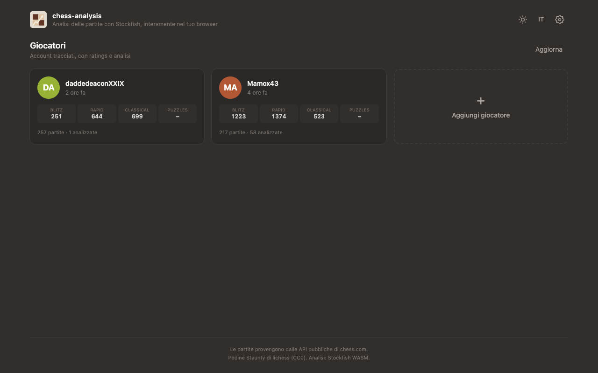
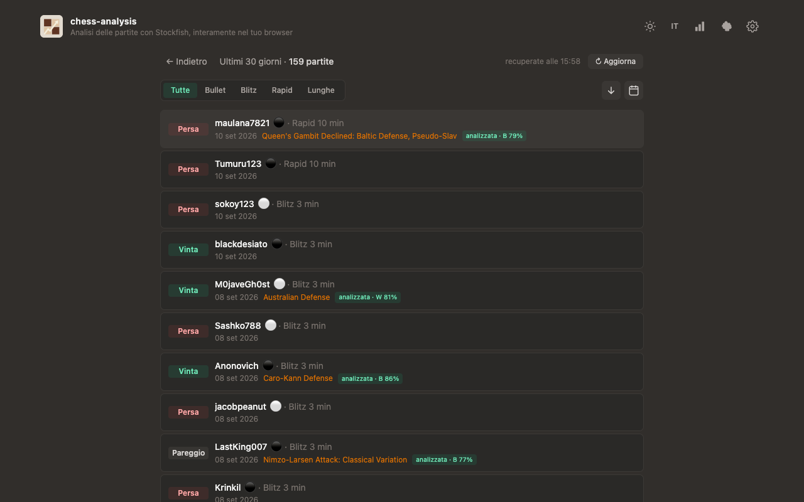
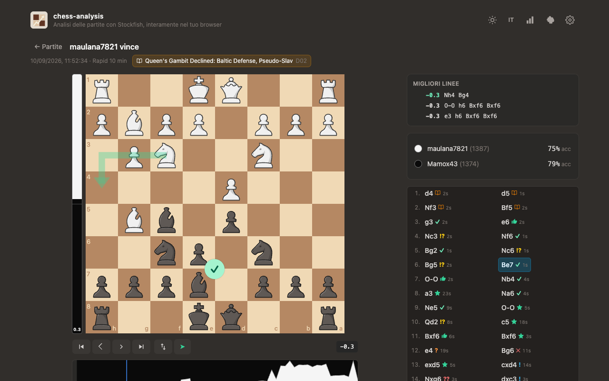
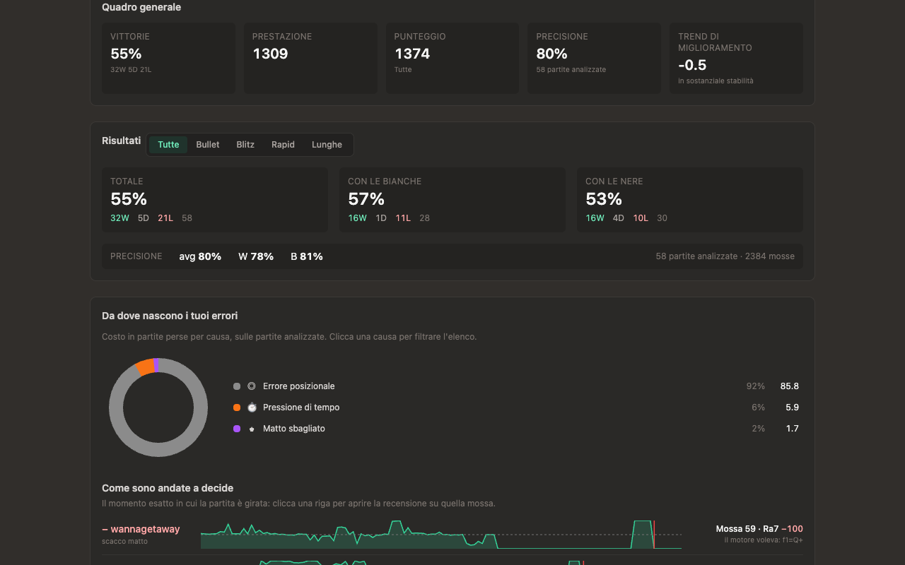
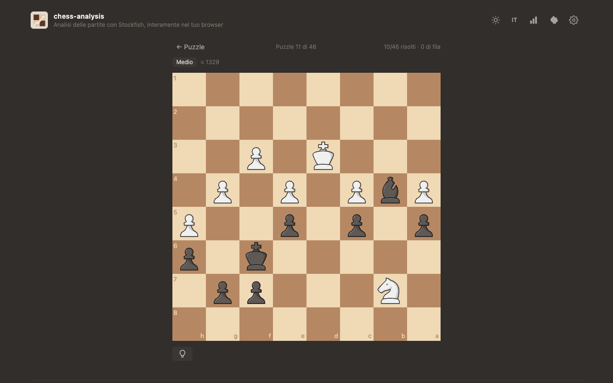
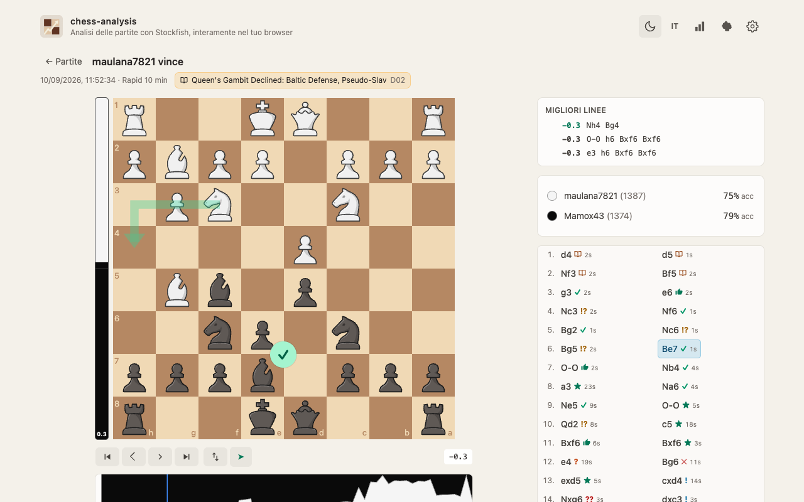
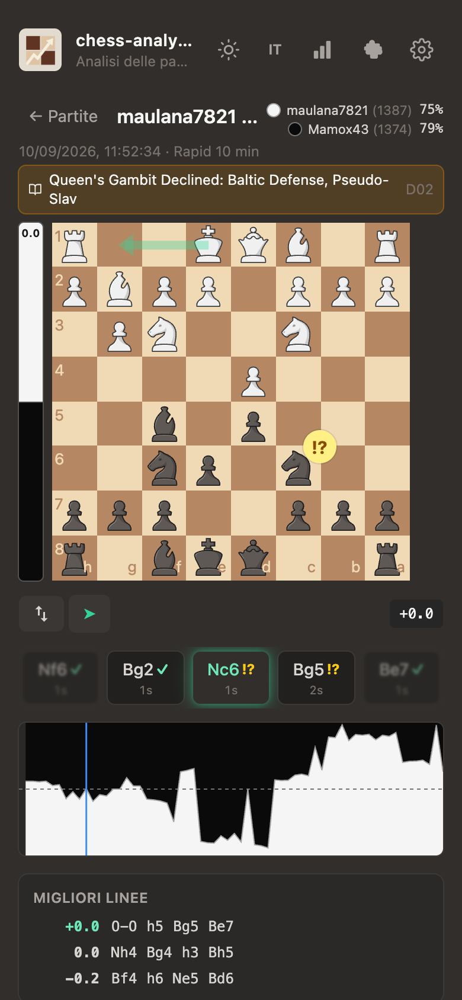
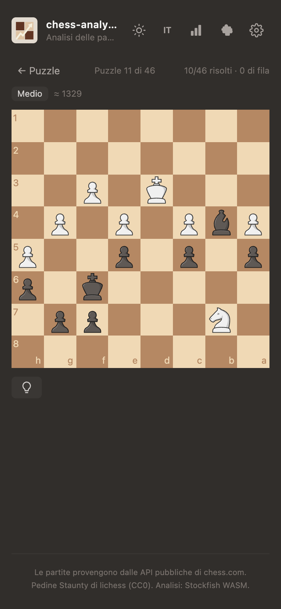

# chess-analysis

[](https://github.com/M2Max/chess-analysis/actions/workflows/docker.yml)
[](./LICENSE)
[](https://bun.sh)
[](https://stockfishchess.org)
[](./docs/DEPLOYMENT.md)

**Game review, entirely in your browser.** Add a chess.com player (track as
many as you like) and Stockfish 18 (WASM) analyses their last-30-days games
on your device: per-move classification (`!!` `!` `?` `??` and friends),
eval bar, advantage graph, top-3 engine lines (clickable), thinking time for
every move, accuracy, and branching - drag any legal move off the mainline and
it's evaluated immediately, with "Back to game" to return. Missed wins and
mates are distilled into **tactics puzzles** validated by the engine. No
server computation, no API keys.

| Players | Games |
|---|---|
|  |  |
| **Review** | **Stats** |
|  |  |
| **Puzzles** | **Light mode** |
|  |  |
| **Review · mobile** | **Puzzle · mobile** |
|  |  |

## Features

- 👥 Multi-user: track several chess.com accounts - grid of cards with
  ratings per time class, time since last game, add/remove (removal wipes
  that player's stored data)
- 🧠 In-browser Stockfish 18 WASM analysis - Lite (~7 MB, instant) or Full
  (~113 MB, strongest) net, single- or multi-threaded (auto-detected)
- 🎯 Review-style move categories: `!!` brilliant · `!` great · `★` best ·
  `👍` excellent · `✓` good · `!?` inaccuracy · `?` mistake · `??` blunder ·
  `✕` missed win
- 📊 Per-player accuracy (expected-loss model, rating-scaled) and the
  engine's top-3 lines for every position
- 🔀 Branching: explore any off-mainline line, evaluated on the fly
- ⏱️ Thinking time on every move, read from the chess.com clock data and
  shown next to each move (under it on mobile)
- 📈 Stats view: resumable 30-day full-analysis run; win-probability curves
  (Stockfish's own WDL model) with the decisive move marked, a loss autopsy
  where every row jumps straight to the move that decided the game, a
  mistake-cause donut (hanging pieces, forks, missed captures, time
  trouble), clock panel, phase split, conversion of won positions,
  performance rating vs expected score, improvement trend, Elo trajectory
- 🖱️ Every chart is interactive: exact values on hover, click to jump into
  the review at that move; engine best lines are clickable - tap a move to
  replay the line as an analysed branch
- 🧩 Puzzles distilled from your own analysed games (missed wins, missed
  mates, punishment of your opponent's blunders) - engine-validated for a
  unique sound solution, with difficulty tiers, a light-bulb hint (piece
  highlight + 30s countdown, then the solution), wrong-move feedback and a
  jump back to the source game; the hub tracks solved/unsolved and always
  resumes where you left off
- 📖 Opening recognition (Lichess CC0 dataset, 3,810 openings) with book
  moves marked on the board and in the move list
- 🗄️ Server-side SQLite (bun:sqlite): games and analyses shared across all
  your devices; re-opening an analysed game is instant
- 🌗 Dark + light themes · 🌐 Italiano (default) / English · 📱 mobile layout
  with a swipeable move strip

## Quick start

```sh
bun install          # postinstall fetches the Stockfish builds + opening index
bun run dev          # frontend  -> http://localhost:5173
bun server/index.ts  # data API + SQLite -> http://localhost:3000
bun test             # 272 tests
```

`?demo` loads the Opera Game (Morphy 1858) fully offline.

## Deploy

Multi-arch images (`linux/amd64` + `linux/arm64`) are built automatically by
[GitHub Actions](./.github/workflows/docker.yml) on every push to `main` and
published to `ghcr.io/m2max/chess-analysis` (tags: `latest`, `sha-<commit>`,
version).

```sh
docker login ghcr.io   # token with packages: read
docker compose up -d   # or: REGISTRY=<host:port>/<user> for a LAN registry
```

Full guide (TrueNAS Scale custom app, self-signed HTTPS, insecure-registry
script, data backup): **[docs/DEPLOYMENT.md](./docs/DEPLOYMENT.md)**

## Docs

| | |
|---|---|
| [docs/ARCHITECTURE.md](./docs/ARCHITECTURE.md) | Engine, classification, accuracy, openings, state, analysis store, settings, testing |
| [docs/DEPLOYMENT.md](./docs/DEPLOYMENT.md) | Registries, TrueNAS Scale, certificates, SQLite backup |
| [docs/SECURITY-AUDIT.md](./docs/SECURITY-AUDIT.md) | Secret scan, hardening, residual risks |
| [docs/STATS-ROADMAP.md](./docs/STATS-ROADMAP.md) | Stats metrics: research behind each one, what shipped, non-goals |
| [docs/FEATURE-PUZZLES.md](./docs/FEATURE-PUZZLES.md) | Puzzles from your own games: selection + validation design |
| [docs/PRE-PUBLISH-CHECKLIST.md](./docs/PRE-PUBLISH-CHECKLIST.md) | Final publish report |

## License

App code: **MIT** ([LICENSE](./LICENSE)). Third-party components keep their
own licenses: the **Stockfish** engine (WASM, driven over UCI in a worker) is
**GPL-3.0**, the Staunty pieces and opening names (Lichess) are **CC0**,
chess.js is **BSD-2-Clause**, everything else MIT. Game history comes from
the public chess.com APIs (credited in the app footer).
